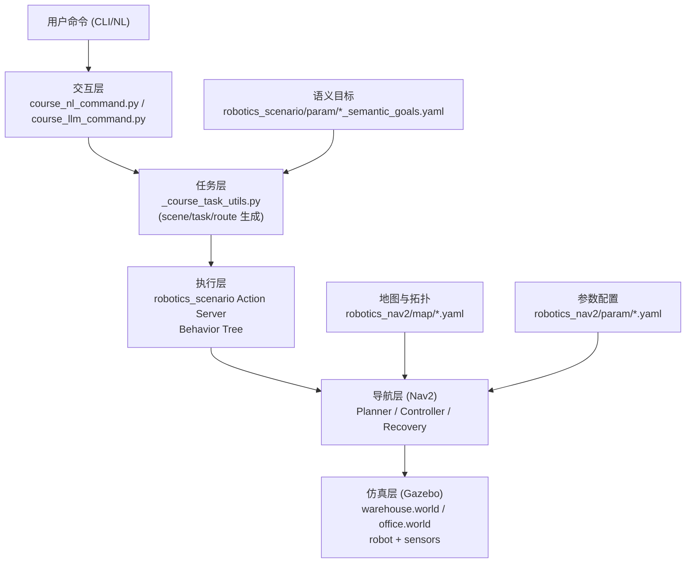
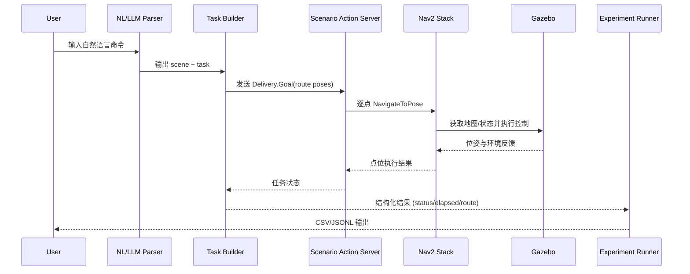
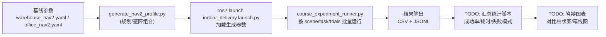

# 《机器人技术》课程项目阶段二完整系统方案（工程应用项目）

## 1. 项目目标与应用场景

### 1.1 项目目标
- 构建一个基于 ROS 2 Humble + Gazebo Classic + Nav2 的室内移动机器人仿真系统。
- 在两类典型场景（仓储、办公）中完成配送与巡检任务。
- 提供自然语言到任务执行的交互链路，并接入 LLM 语义解析层。
- 为阶段三的完整演示与评估提供可复现实验基础。

### 1.2 场景定义
- 场景 A（warehouse）：仓储配送与巡检，语义点包括入库区、货架区、出库区、充电位。
- 场景 B（office）：办公配送与巡检，语义点包括补给点、茶水间、巡检点、充电位。

对应实现：
- 世界与模型：`robotics_gazebo/worlds/warehouse.world`、`robotics_gazebo/worlds/office.world`
- 地图与拓扑：`robotics_nav2/map/*_map.yaml`、`robotics_nav2/map/*_topology.yaml`
- 场景任务：`robotics_scenario/scripts/_course_task_utils.py`

## 2. 基本功能定义

系统当前支持以下核心功能：
- 双场景启动与切换（`warehouse` / `office`）。
- 基于 Nav2 的全局规划与局部控制导航。
- 预设任务调度：`delivery`、`patrol`、`demo`。
- 语义目标点驱动的多点导航执行。
- 自然语言命令解析（规则解析 + LLM 解析 + fallback）。
- 实验批量运行与结果导出（JSONL/CSV）。

典型命令入口：
- 启动：`ros2 launch robotics_nav2 indoor_delivery.launch.py ...`
- 任务调度：`ros2 run robotics_scenario course_task_dispatcher.py --scene ... --task ...`
- NL 解析：`ros2 run robotics_scenario course_nl_command.py "..."`
- LLM 解析：`ros2 run robotics_scenario course_llm_command.py "..."`
- 实验记录：`ros2 run robotics_scenario course_experiment_runner.py ...`

## 3. 逻辑架构

### 3.1 分层逻辑
- 交互层：接收文本命令（规则解析或 LLM 解析）。
- 任务层：将命令映射为场景化任务模板（scene/task/route）。
- 执行层：通过 ROS 2 Action 下发导航目标序列。
- 导航层：Nav2 完成规划、控制、恢复与避障。
- 仿真层：Gazebo 提供世界、机器人与传感器仿真。

### 3.1.1 系统总体架构图

### 3.2 关键流程（命令到执行）
1. 用户输入命令（CLI 文本）。
2. `course_nl_command.py` 或 `course_llm_command.py` 解析出 `scene + task`。
3. `_course_task_utils.py` 生成 `Delivery.Goal`（含语义路线与姿态点）。
4. `robotics_scenario` Action Server 执行行为树，逐点调用 `NavigateToPose`。
5. Nav2 在对应地图/参数下完成路径规划与控制。
6. 返回任务状态并由实验脚本记录。

### 3.2.1 运行时序图（命令到执行到记录）

## 4. 技术架构与仓库模块分工

### 4.1 软件与运行环境
- Ubuntu 22.04
- ROS 2 Humble
- Gazebo 11 (Classic)
- Nav2

### 4.2 模块职责
- `robotics_description`：机器人 URDF/Xacro 与描述启动。
- `robotics_gazebo`：世界文件、模型资源、仿真启动。
- `robotics_nav2`：地图、拓扑、Nav2 参数与导航启动。
- `robotics_scenario`：任务逻辑、行为树、调度脚本、NL/LLM 命令入口。
- `robotics_localization`：定位相关配置与节点。
- `robotics_interfaces`：自定义消息/服务/动作接口。
- `tools`：阶段二演示与校验脚本。

## 5. 仿真环境搭建方案

### 5.1 搭建步骤
1. 安装 ROS 2 与依赖（见 `README.md` 的 apt 安装列表）。
2. `colcon build --symlink-install` 编译指定包。
3. `source /opt/ros/humble/setup.bash` 与 `source install/local_setup.bash`。
4. 启动 `indoor_delivery.launch.py`，按 `scene` 切换场景。

### 5.2 运行模式
- 无头运行（推荐实验记录）。
- RViz 可视化模式（中期答辩展示）。
- Gazebo GUI 模式（环境/轨迹直观展示）。

### 5.3 阶段二演示脚本
- `tools/run_stage2_demo_wsl.sh` 支持按场景启动并触发 `demo` 任务。
- `tools/validate_stage2_demo.py` 对语义点与 demo 路线做一致性验证。

## 6. 数据集与模型资源方案

### 6.1 已使用资源
- 地图资源：`warehouse_map`、`office_map`（占据栅格）。
- 语义点数据：`warehouse_semantic_goals.yaml`、`office_semantic_goals.yaml`。
- 仿真场景资源：
  - AWS RoboMaker 仓储资产（warehouse）
  - RMF office 相关资产（office）

### 6.2 基础模型资源（LLM）
- 使用 OpenAI Responses API 作为语义解析层（见 `course_llm_command.py`）。
- 默认模型参数读取 `OPENAI_MODEL`，默认值为 `gpt-5.4-mini`。
- 无 API Key 时自动 fallback 到规则解析器。

### 6.3 补充说明（阶段二材料）
- 公开数据集使用情况：无。本项目未引入额外公开数据集，主要使用仿真内建资源与项目内地图资产（`robotics_nav2/map/*.yaml` 与对应栅格图文件）。
- LLM 调用成本估算口径（答辩统一口径）：
  - 统计维度：按“单次指令调用”与“整场演示会话”两层统计输入/输出 token。
  - 成本计算：总成本 =（输入 token / 1000 × 输入单价）+（输出 token / 1000 × 输出单价），单价以答辩当日所用模型官方价格为准。
  - 结果表达：同时给出单次调用成本区间（min/median/max）与会话总成本区间，并标注样本量与场景类型（delivery/patrol/demo）。
  - 异常处理：网络失败或超时后回退规则解析的请求记为“0 模型成本、1 次失败样本”，单独计入稳定性统计。

## 7. 技术路线（对齐课程 2.1 技术要求）

### 7.1 感知与环境建模
- 现状：
  - 已使用占据栅格地图进行导航（`*_map.yaml`）。
  - 已具备拓扑地图配置（`*_topology.yaml`）。
- 补充说明（答辩可直接引用）：
  - 传感器模态：2D 激光雷达（LiDAR），实际 topic 为 `/scan`（`sensor_msgs/LaserScan`）。
  - 用途 1：实时障碍物感知与避障（驱动局部代价地图更新）。
  - 用途 2：与 `*_map.yaml` 静态地图匹配，支撑定位（AMCL/scan matching）。
  - 用途 3：为局部规划器提供环境几何约束，提升动态场景通行安全性。
  - 地图构建流程：采用“离线构建 + 运行时复用 + 局部在线更新”的策略。
  - 阶段 A（离线建图）：在目标场地通过 SLAM 采集并生成 `*_map.yaml`（及对应栅格图文件）。
  - 阶段 B（运行复用）：导航阶段直接加载静态地图用于全局规划与定位。
  - 阶段 C（在线维护）：运行中不进行全局重建，仅利用传感器对局部代价地图做在线更新以响应临时障碍。

### 7.2 实时定位
- 现状：
  - 使用 Nav2 导航栈并包含 localization 包配置。
- 补充说明（答辩可直接引用）：
  - 当前主用定位方法为 AMCL（`nav2_amcl`），已在 `office_stage2_demo.yaml` 与 `warehouse_stage2_demo.yaml` 中显式启用 `amcl` 参数块。
  - 关键参数依据如下：
  - 参数组 1（坐标系与传感器链路）：`global_frame_id=map`、`odom_frame_id=odom`、`scan_topic=scan`，用于保证“地图-里程计-激光”链路闭环一致。
  - 参数组 2（粒子滤波规模）：`min_particles=500`、`max_particles=2000`，在收敛速度与计算开销之间取平衡，适配课程场景中的中等规模室内环境。
  - 参数组 3（观测模型）：`laser_model_type=likelihood_field`、`laser_likelihood_max_dist=2.0`，用于提升在存在局部遮挡时的匹配鲁棒性。
  - 参数组 4（运动模型）：`robot_model_type=nav2_amcl::DifferentialMotionModel`，与当前差速底盘运动学假设一致。
  - 证据补充计划（定位稳定性）：
  - 任务 A（漂移评估）：固定起点重复 10 次导航，记录目标点到达时 `map` 系位姿误差（平移/偏航），输出均值与标准差。
  - 任务 B（重定位能力）：人为施加位姿扰动后发布 `initialpose`，统计重定位成功率与恢复时间（建议 10 次以上）。
  - 任务 C（数据留痕）：记录 `/amcl_pose`、`/tf`、`/scan` 与导航结果日志，形成可复核表格与答辩图表。

### 7.3 运动控制与避障
- 现状：
  - 具备可切换避障配置：`baseline_costmap` / `collision_monitor` / `stage2_demo`。
  - `generate_nav2_profile.py` 可批量生成参数组合。
- TODO:
  - TODO: 按“至少 2 种避障策略”给出对比结果表（成功率、碰撞、时间）。
  - TODO: 补充各策略适用条件分析（窄通道、动态障碍、保守/激进参数）。

### 7.4 路径规划
- 现状：
  - 已支持两类全局规划配置：`navfn_astar` 与 `smac_2d`。
  - 可通过实验脚本批量跑多次并导出 CSV/JSONL。
- TODO:
  - TODO: 输出正式对比实验报告（路径长度、耗时、成功率、失败模式）。
  - TODO: 解释配置选择依据与性能影响（满足课程“说明依据”要求）。

### 7.5 应用场景
- 现状：
  - 已实现 `warehouse` 与 `office` 两个独立场景。
  - 每场景具备 `delivery/patrol/demo` 三类任务逻辑。
- TODO:
  - TODO: 为每个场景补全“成功/失败判定标准”文档化定义。
  - TODO: 为每个场景补全“量化评估指标”与阈值。

### 7.6 人机交互
- 现状：
  - 已有自然语言交互接口（规则解析）。
  - 支持中英文关键词映射。
- TODO:
  - TODO: 补充交互可靠性评估（误判率、歧义命令样本）。

### 7.7 LLM/VLM/VLA 集成
- 现状：
  - 已接入 LLM 语义规划层（OpenAI Responses API）。
  - 使用 JSON Schema 约束输出，失败自动回退规则解析。
  - 支持 `--dry-run` 与 `--save-json` 便于记录。
- TODO:
  - TODO: 系统记录真实失效案例（至少覆盖误解析/超时/API异常）。
  - TODO: 统计推理时延分布与解析成功率（按场景/任务分类）。
  - TODO: 补充 prompt 与关键脚本附件整理（满足 AI 工具说明条款）。

### 7.8 系统与部署分析
- 现状：
  - 已明确仿真运行栈与 WSL 运行路径。
- TODO:
  - TODO: 增补硬件平台选型论证（室内场景、算力、成本、负载）。
  - TODO: 增补 sim-to-real 障碍清单与对应迁移策略（传感器噪声、延迟、控制误差等）。

## 8. 阶段二实验与评估计划（中期答辩可执行版）

### 8.1 最小实验矩阵
- 场景：`warehouse`、`office`
- 任务：`delivery`、`patrol`（`demo` 作为演示补充）
- 规划：`navfn_astar`、`smac_2d`
- 避障：`baseline_costmap`、`collision_monitor`
- 重复次数：每组合 `trials >= 3`

### 8.2 指标定义
- 成功率：成功 trial 数 / 总 trial 数
- 平均任务耗时：`elapsed_sec` 平均值
- 失败率：`status != SUCCEEDED` 占比
- TODO: 路径长度（当前脚本未直接输出，需要补充采集）
- TODO: 碰撞/近碰指标（需要从日志或 topic 增加采集）

### 8.3 输出物
- 自动输出：CSV + JSONL（`course_experiment_runner.py` 已支持）。
- TODO: 统一汇总脚本（多组合自动聚合为一张总表）。
- TODO: 图表化输出（柱状图/箱线图）用于答辩展示。

### 8.4 实验流水线架构图

## 9. 风险与应对

- 风险 1：WSL 图形渲染不稳定，影响现场演示。
  - 应对：采用 headless + RViz 分离模式，提前录制关键备份视频。
- 风险 2：LLM 网络依赖导致现场不可用。
  - 应对：保留 `--force-fallback` 本地规则模式，确保可演示闭环。
- 风险 3：参数组合过多导致实验时间不足。
  - 应对：先跑最小矩阵，再扩展补充。

## 10. 阶段二交付清单（建议）

- 系统方案文档（本文件）
- 架构图 1 张（逻辑架构 + 数据流）
- 技术要求映射表 1 张（2.1 条目逐项对应证据）
- 最小对比实验结果表（规划 + 避障）
- LLM 接入说明与失败样例摘要
- TODO: AI 工具使用专项说明初稿（工具、成本、局限、验证）

## 11. 当前仓库未覆盖项总览（TODO 汇总）

- TODO: 两类避障策略的量化对比结果表。
- TODO: 两类规划算法的量化对比与分析结论。
- TODO: 各场景成功/失败判定标准与阈值文档化。
- TODO: 路径长度、碰撞指标采集与自动统计。
- TODO: LLM 延迟、成功率、失败模式系统记录。
- TODO: 硬件选型与部署约束分析（成本/算力/场景）。
- TODO: sim-to-real 障碍与迁移策略清单。
- TODO: AI 工具专项说明与附件整理（提示词、Skill、脚本、验证方法）。
