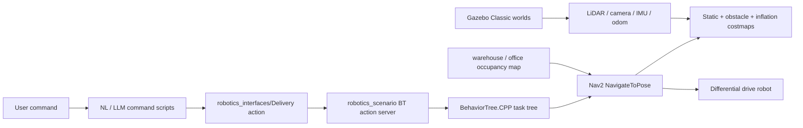

# Option A System Design: Indoor Logistics and Patrol Robot

## Project Positioning

This project follows Option A, the engineering application track. The application is an indoor mobile robot that can run delivery and patrol tasks in two Gazebo Classic scenes:

- `warehouse`: an AWS RoboMaker small warehouse adapted for ROS 2 Humble, map-based Nav2 navigation, and semantic shelf/drop-off routes.
- `office`: an RMF office-inspired floor adapted for mail delivery, supply routing, and checkpoint patrol.

The implementation target is a repeatable simulation stack rather than physical hardware. The final evaluation focuses on executable task flow, navigation reliability, semantic task dispatch, and analysis of sim-to-real gaps.

## Architecture



## Requirement Mapping

| Course requirement | Current implementation | Remaining work |
| --- | --- | --- |
| Perception and map | LiDAR `/scan`, camera `/image_raw`, 2D occupancy maps, AMCL localization | Record map/localization screenshots and discuss map-building source |
| Motion control and obstacle avoidance | Gazebo diff-drive plugin, Nav2 local costmap, Regulated Pure Pursuit, collision monitor profiles | Run baseline vs collision monitor comparison |
| Path planning | NavFn planner with A* enabled and SmacPlanner2D configured | Run planner-profile comparison and summarize route metrics |
| 2+ application scenarios | Warehouse and office scenes; delivery and patrol task presets | Define success/failure criteria per scenario in the report |
| Human interaction | Keyword parser and LLM parser command-line interfaces | Run 10-command LLM reliability test |
| LLM integration | `course_llm_command.py` uses OpenAI Responses API when `OPENAI_API_KEY` is present, with local fallback | Collect latency and failure examples |
| Deployment analysis | WSL/ROS 2 Humble runtime documented | Add hardware selection and sim-to-real migration analysis |

## Executable Task Interfaces

Launch a scene:

```bash
ros2 launch robotics_nav2 indoor_delivery.launch.py scene:=warehouse use_gazebo_gui:=false use_rviz:=true force_software_rendering:=true
```

Dispatch a preset task:

```bash
ros2 run robotics_scenario course_task_dispatcher.py --scene warehouse --task delivery
```

Dispatch through the LLM semantic layer:

```bash
export OPENAI_API_KEY=<key>
ros2 run robotics_scenario course_llm_command.py "send the office robot to patrol all checkpoints"
```

Run without network/API dependency:

```bash
ros2 run robotics_scenario course_llm_command.py --force-fallback --dry-run "办公室巡检一圈"
```

## Midterm Narrative

The midterm story should emphasize that the system is already an executable simulation architecture. The open work is not basic scaffolding; it is systematic evaluation:

1. Two realistic indoor scenes are connected to one reusable ROS 2 task interface.
2. The robot has map-based navigation, localization, task behavior trees, and semantic waypoints.
3. The new LLM layer turns natural language into executable delivery/patrol actions.
4. The final phase will compare planners and avoidance strategies quantitatively.

